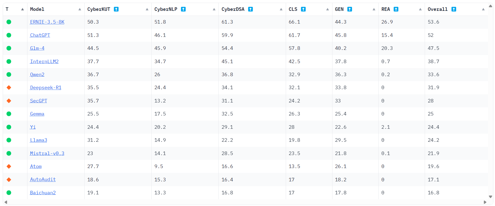

# SecBen

The open FinLLM leaderboard are available on [SecBen](https://huggingface.co/spaces/lthc/secben).



SecBen is a comprehensive cybersecurity benchmark featuring 12 datasets and 18k samples, with pre-defined labels and extensible metrics. 

Sourced from high-quality open-source corpora and expert-annotated prompts, it evaluates LLMs across three skill levels based on Bloom's cognitive model: CyberKUT, CyberNLP, and CyberDSA.

## Tasks

| Task       | Language | Dataset     | Size | Metrics             | Length Type | NLP Type            | License         |
|------------|----------|-------------|------|---------------------|-------------|---------------------|-----------------|
| CyberKUT   | zh       | NetQA       | 2000 | ROUGE, BERTScore    | Sentence    | Generation (GEN)    | WTFPL           |
| CyberKUT   | en       | Embed       | 1539 | ROUGE, BERTScore    | Sentence    | Generation (GEN)    | Public          |
| CyberKUT   | en       | Metric      | 2558 | ACC, F1             | Sentence    | Classification (CLS)| Public          |
| CyberKUT   | zh       | CodeQA      | 2000 | CodeBERTScore       | Paragraph   | Generation (GEN)    | CC-BY-NC-4.0    |
| CyberNLP   | en       | Corpus      | 200  | ACC, F1             | Sentence    | Classification (CLS)| Public          |
| CyberNLP   | zh       | CDTier      | 520  | ACC, F1             | Paragraph   | Classification (CLS)| Public          |
| CyberNLP   | en       | NER         | 841  | EntityF1            | Paragraph   | Reasoning (REA)     | MIT License     |
| CyberNLP   | en       | HackerNews  | 748  | ROUGE, BERTScore    | Passage     | Generation (GEN)    | Public          |
| CyberDSA   | en       | MaliURLs    | 2000 | ACC, F1             | Sentence    | Classification (CLS)| Public          |
| CyberDSA   | en       | CSIC2010    | 2000 | ACC, F1             | Paragraph   | Classification (CLS)| Public          |
| CyberDSA   | en       | BETH        | 2000 | ACC, F1             | Paragraph   | Classification (CLS)| Public          |
| CyberDSA   | en       | MITRE       | 2000 | ACC, F1             | Sentence    | Classification (CLS)| Apache-2.0      |

## LLMs

| Model            | Parameters | Pre-trained | Fine-tuned | Access   | Base LLM              | Release Date  |
|------------------|------------|-------------|------------|----------|-----------------------|---------------|
| Gemma            | 7B         | ✓           | ✗          | Weights  | –                     | 06/27/2024    |
| Llama3           | 8B         | ✓           | ✗          | Weights  | –                     | 04/18/2024    |
| Mistral-V0.3     | 7B         | ✓           | ✗          | Weights  | –                     | 05/22/2024    |
| ChatGPT          | 175B       | ✓           | ✗          | API      | –                     | 11/30/2022    |
| Atom             | 7B         | ✗           | ✓          | Weights  | LLaMA2-7B             | 08/28/2023    |
| Baichuan2        | 7B         | ✓           | ✗          | Weights  | –                     | 09/06/2023    |
| DeepSeek-R1      | 7B         | ✗           | ✓          | Weights  | Qwen2.5-Math-7B       | 02/09/2025    |
| ERNIE-3.5-8K     | ~1000B     | ✓           | ✗          | API      | –                     | 07/01/2024    |
| GLM-4            | 9B         | ✓           | ✗          | Weights  | –                     | 06/05/2024    |
| InternLM2        | 7B         | ✓           | ✗          | Weights  | –                     | 01/17/2024    |
| Qwen2            | 7B         | ✓           | ✗          | Weights  | –                     | 06/06/2024    |
| Yi               | 6B         | ✓           | ✗          | Weights  | –                     | 11/02/2023    |
| AutoAudit        | 7B         | ✗           | ✓          | Weights  | Alpaca-Lora-7B        | 07/03/2023    |
| SecGPT           | 13B        | ✗           | ✓          | Weights  | Baichuan-13B          | 11/22/2023    |


## Overall Results

| Model          | Cybersecurity Task |              |              | NLP Main Task |              |              | Overall |
|----------------|--------------------|--------------|--------------|---------------|--------------|--------------|---------|
|                | CyberKUT           | CyberNLP     | CyberDSA     | CLS           | GEN          | REA          |         |
| Gemma          | 0.255              | 0.175        | 0.325        | 0.263         | 0.254        | 0.000        | 0.250   |
| Llama3         | 0.312              | 0.149        | 0.222        | 0.198         | 0.295        | 0.000        | 0.242   |
| Mistral-V0.3   | 0.230              | 0.141        | 0.285        | 0.235         | 0.218        | 0.001        | 0.219   |
| ChatGPT        | **0.513**          | 0.461        | 0.599        | 0.617         | **0.458**    | 0.154        | 0.520   |
| Atom           | 0.277              | 0.095        | 0.166        | 0.135         | 0.261        | 0.000        | 0.196   |
| Baichuan2      | 0.191              | 0.133        | 0.168        | 0.170         | 0.178        | 0.000        | 0.168   |
| DeepSeek-R1    | 0.355              | 0.244        | 0.341        | 0.321         | 0.338        | 0.000        | 0.319   |
| ERNIE-3.5-8K   | 0.503              | **0.518**    | **0.613**    | **0.661**     | 0.443        | **0.269**    | **0.536** |
| GLM-4          | 0.445              | 0.459        | 0.544        | 0.578         | 0.402        | 0.203        | 0.475   |
| InternLM2      | 0.377              | 0.347        | 0.451        | 0.425         | 0.378        | 0.007        | 0.387   |
| Qwen2          | 0.367              | 0.260        | 0.368        | 0.329         | 0.363        | 0.002        | 0.336   |
| Yi             | 0.244              | 0.202        | 0.291        | 0.280         | 0.226        | 0.021        | 0.244   |
| AutoAudit      | 0.186              | 0.153        | 0.164        | 0.170         | 0.182        | 0.000        | 0.171   |
| SecGPT         | 0.357              | 0.132        | 0.311        | 0.242         | 0.330        | 0.000        | 0.280   |


## Detailed Results


| Cybersecurity Task | Dataset     | Metrics           | Gemma  | Llama3 | Mistral-V0.3 | ChatGPT | Atom  | Baichuan2 | DeepSeek-R1 | ERNIE-3.5-8K | GLM-4 | InternLM2 | Qwen2 | Yi   | AutoAudit | SecGPT |
|--------------------|-------------|-------------------|--------|--------|--------------|---------|-------|-----------|-------------|--------------|-------|-----------|-------|------|-----------|--------|
| CyberKUT           | NetQA       | ROUGE-1           | 0.027  | 0.022  | 0.038        | **0.143** | 0.033 | 0.030     | 0.062       | 0.109        | 0.061 | 0.119     | 0.110 | 0.032| 0.039     | 0.034  |
|                    |             | ROUGE-2           | 0.004  | 0.003  | 0.005        | **0.028** | 0.004 | 0.004     | 0.013       | 0.017        | 0.009 | 0.018     | 0.022 | 0.005| 0.006     | 0.006  |
|                    |             | ROUGE-L           | 0.027  | 0.022  | 0.038        | **0.140** | 0.033 | 0.030     | 0.062       | 0.107        | 0.061 | 0.117     | 0.109 | 0.032| 0.039     | 0.034  |
|                    |             | BERTScore(F1)     | 0.587  | 0.565  | 0.619        | **0.756** | 0.573 | 0.577     | 0.656       | 0.724        | 0.539 | 0.741     | 0.728 | 0.587| 0.610     | 0.609  |
|                    | Embed       | ROUGE-1           | 0.406  | 0.380  | 0.395        | 0.421   | 0.126 | 0.229     | 0.385       | 0.400        | **0.441** | 0.425 | 0.439 | 0.147| 0.179     | 0.396  |
|                    |             | ROUGE-2           | 0.141  | 0.127  | 0.134        | 0.138   | 0.037 | 0.068     | 0.112       | 0.125        | **0.164** | 0.146 | 0.163 | 0.047| 0.054     | 0.133  |
|                    |             | ROUGE-L           | 0.261  | 0.247  | 0.256        | 0.242   | 0.094 | 0.160     | 0.222       | 0.229        | 0.263 | 0.261     | **0.275** | 0.100| 0.137 | 0.252  |
|                    |             | BERTScore(F1)     | 0.747  | 0.719  | 0.713        | 0.730   | 0.279 | 0.476     | 0.734       | 0.723        | 0.754 | 0.753     | **0.762** | 0.401| 0.568 | 0.737  |
|                    | Metric      | ACC               | 0.160  | 0.216  | 0.248        | **0.865** | 0.220 | 0.248     | 0.248       | 0.834        | 0.774 | 0.151     | 0.250 | 0.248| 0.248     | 0.248  |
|                    |             | F1                | 0.091  | 0.095  | 0.098        | **0.865** | 0.096 | 0.098     | 0.098       | 0.834        | 0.772 | 0.112     | 0.105 | 0.098| 0.098     | 0.098  |
|                    | CodeQA      | CodeBERTScore(P)  | 0.271  | 0.475  | 0.161        | 0.694   | 0.591 | 0.182     | 0.566       | **0.702**    | 0.541 | 0.569     | 0.502 | 0.418| 0.153     | 0.595  |
|                    |             | CodeBERTScore(R)  | 0.286  | 0.509  | 0.177        | 0.728   | 0.601 | 0.194     | 0.615       | **0.759**    | 0.642 | 0.639     | 0.572 | 0.438| 0.158     | 0.624  |
|                    |             | CodeBERTScore(F1) | 0.278  | 0.490  | 0.168        | 0.708   | 0.594 | 0.187     | 0.588       | **0.728**    | 0.586 | 0.600     | 0.533 | 0.427| 0.155     | 0.608  |
|                    |             | CodeBERTScore(F3) | 0.284  | 0.505  | 0.175        | 0.724   | 0.600 | 0.192     | 0.609       | **0.752**    | 0.629 | 0.631     | 0.564 | 0.436| 0.158     | 0.621  |
| CyberNLP           | Corpus      | ACC               | 0.240  | 0.190  | 0.280        | 0.565   | 0.090 | 0.305     | 0.605       | **0.650**    | 0.485 | 0.500     | 0.535 | 0.535| 0.290     | 0.165  |
|                    |             | F1                | 0.325  | 0.275  | 0.352        | 0.589   | 0.148 | 0.379     | 0.543       | **0.657**    | 0.536 | 0.541     | 0.574 | 0.584| 0.368     | 0.257  |
|                    | CDTier      | ACC               | 0.112  | 0.104  | 0.012        | 0.473   | 0.002 | 0.000     | 0.144       | **0.677**    | 0.579 | 0.510     | 0.073 | 0.048| 0.025     | 0.060  |
|                    |             | F1                | 0.155  | 0.110  | 0.022        | 0.489   | 0.003 | 0.000     | 0.126       | **0.690**    | 0.593 | 0.530     | 0.123 | 0.080| 0.041     | 0.071  |
|                    | NER         | EntityF1          | 0.000  | 0.000  | 0.001        | 0.154   | 0.000 | 0.000     | 0.000       | **0.269**    | 0.203 | 0.007     | 0.002 | 0.021| 0.000     | 0.000  |
|                    | HackerNews  | ROUGE-1           | 0.083  | 0.060  | 0.054        | **0.452** | 0.054 | 0.039     | 0.083       | 0.397        | 0.397 | 0.176     | 0.171 | 0.064| 0.069     | 0.060  |
|                    |             | ROUGE-2           | 0.023  | 0.016  | 0.012        | **0.249** | 0.014 | 0.010     | 0.025       | 0.208        | 0.224 | 0.073     | 0.067 | 0.019| 0.020     | 0.015  |
|                    |             | ROUGE-L           | 0.074  | 0.053  | 0.048        | **0.405** | 0.047 | 0.035     | 0.070       | 0.350        | 0.360 | 0.154     | 0.150 | 0.056| 0.063     | 0.054  |
|                    |             | BERTScore(F1)     | 0.567  | 0.535  | 0.491        | **0.773** | 0.498 | 0.430     | 0.602       | 0.760        | 0.754 | 0.629     | 0.645 | 0.414| 0.501     | 0.507  |
| CyberDSA           | MaliURLs    | ACC               | 0.360  | 0.243  | 0.180        | 0.727   | 0.036 | 0.081     | 0.203       | **0.857**    | 0.643 | 0.346     | 0.266 | 0.206| 0.074     | 0.145  |
|                    |             | F1                | 0.466  | 0.301  | 0.233        | 0.749   | 0.062 | 0.139     | 0.213       | **0.861**    | 0.704 | 0.477     | 0.352 | 0.183| 0.119     | 0.114  |
|                    | CSIC2010    | ACC               | 0.057  | 0.123  | 0.182        | 0.629   | 0.021 | 0.034     | 0.402       | **0.769**    | 0.748 | 0.676     | 0.294 | 0.135| 0.125     | 0.292  |
|                    |             | F1                | 0.103  | 0.206  | 0.282        | 0.668   | 0.040 | 0.064     | 0.476       | **0.762**    | 0.674 | 0.649     | 0.405 | 0.221| 0.203     | 0.387  |
|                    | BETH        | ACC               | **0.837** | 0.367 | 0.667     | 0.782   | 0.544 | 0.437     | 0.728       | 0.569        | 0.772 | 0.719     | 0.805 | 0.817| 0.326     | 0.789  |
|                    |             | F1                | 0.768  | 0.493  | 0.675        | **0.808** | 0.624 | 0.587     | 0.710       | 0.627        | 0.786 | 0.719     | 0.780 | 0.767| 0.467     | 0.745  |
|                    | MITRE       | ACC               | 0.003  | 0.019  | 0.040        | 0.208   | 0.005 | 0.003     | 0.000       | **0.235**    | 0.017 | 0.010     | 0.021 | 0.001| 0.001     | 0.010  |
|                    |             | F1                | 0.004  | 0.025  | 0.025        | 0.225   | 0.000 | 0.002     | 0.000       | **0.229**    | 0.006 | 0.013     | 0.026 | 0.002| 0.000     | 0.010  |


## Evaluation

### Preparation

#### Locally install
```bash
cd SecBen
pip install -r requirements.txt
cd src/sec-evaluation
pip install -e .[multilingual]
```

#### Automated Task Assessment

Evaluate model hosted on HuggingFace
```bash
bash scripts/run_evaluation.sh
```

or 

Use Commercial API
```bash
bash scripts/run_api.sh
```

### Create new tasks

Creating a new task for FinBen involves creating a Huggingface dataset and implementing the task in a Python file. This guide walks you through each step of setting up a new task using the FinBen framework.

#### Creating your dataset in Huggingface

Your dataset should be created in the following format:

```python
{
    "query": "...",
    "answer": "...",
    "text": "..."
}
```

In this format:

- `query`: Combination of your prompt and text
- `answer`: Your label
- `choices`: Set of labels
- `gold`: Index of the correct label in choices (Start from 0)
- `label`: List of token labels
- `token`: List of tokens
- `label`: List of sentence labels